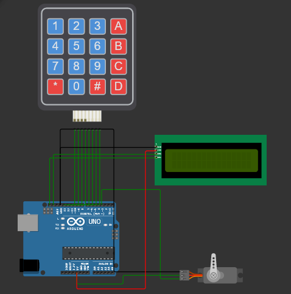
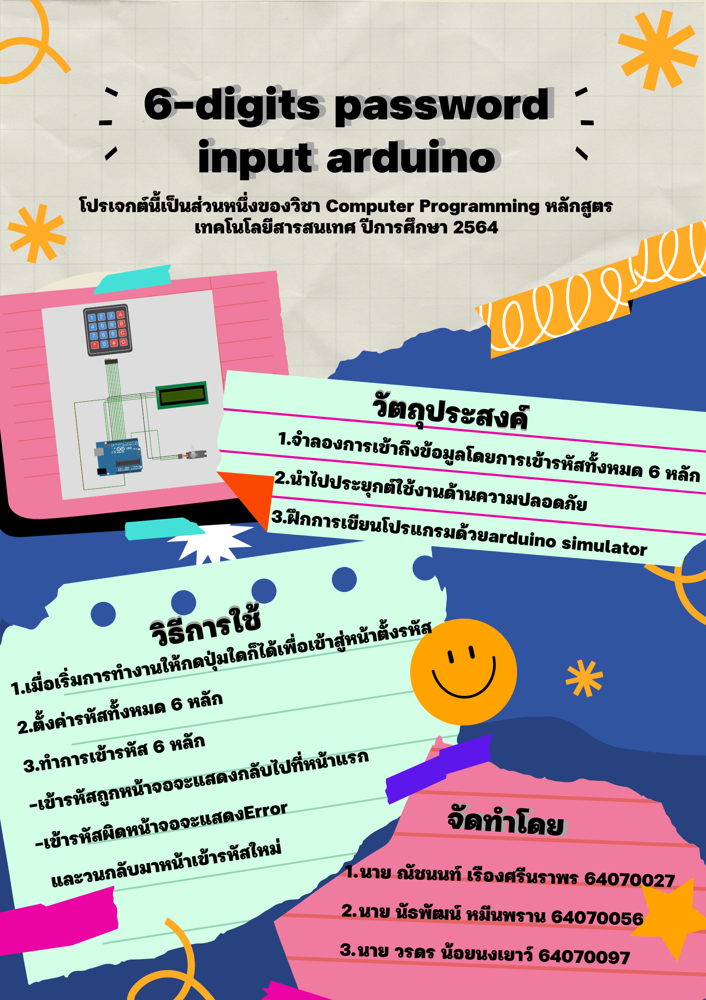

# การเข้ารหัสหกหลักในคีย์แพดด้วย Arduino  (Six Digits Password Keypad With Arduino)
โปรเจกต์นี้เป็นส่วนหนึ่งของวิชา Computer Programming หลักสูตรเทคโนโลยีสารสนเทศ ปีการศึกษา 2564
## จัดทำโดย
1.   นาย ณัชนนท์ เรืองศรีนราพร 64070027
2.   นาย นัธพัฒน์ หมีนพราน 64070056
3.   นาย วรดร น้อยนงเยาว์ 64070097 

## อุปกรณ์ที่ใช้ในวงจร

1. บอร์ด Arduino Uno
2. หน้าจอ LCD
3. Keypad
4. Servomotor 
###
[**การจำลองของการทำงานผ่าน wokwi**](https://wokwi.com/projects/331188136017134163)
## Project Poster

